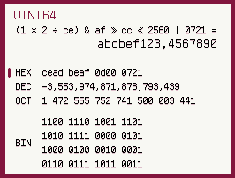
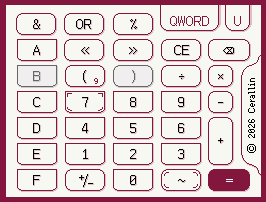

# HexCalculatorDS

An integer calculator for Nintendo DS.

## Proto design

*Will change to real screen shots when all done.*

## Milestones

### v1.0.0

- [ ] input by touching sub screen
- [ ] update current number when 
- [ ] implement operators except quotes
- [ ] add quotes to the formula tree
- [ ] switch depth: `QWORD`/`DWORD`/`WORD`/`BYTE`
- [ ] switch sign: `signed`/`unsigned`
- [ ] switch base: `hex`/`dec`/`oct`/`bin`

### v2.0.0

- [ ] scroll the formula
- [ ] enable download play

### License

This software is under GPL-2.0-or-later license.

    HexCalculatorDS - An integer calculator for Nintendo DS.
    Copyright (C) 2026  Cerallin <cerallin@cerallin.top>

    This program is free software; you can redistribute it and/or modify
    it under the terms of the GNU General Public License as published by
    the Free Software Foundation; either version 2 of the License, or
    (at your option) any later version.

    This program is distributed in the hope that it will be useful,
    but WITHOUT ANY WARRANTY; without even the implied warranty of
    MERCHANTABILITY or FITNESS FOR A PARTICULAR PURPOSE.  See the
    GNU General Public License for more details.

### Third parties

- `libnds` v2.0.1
- A **modified version** of `ark-pixel-font`
