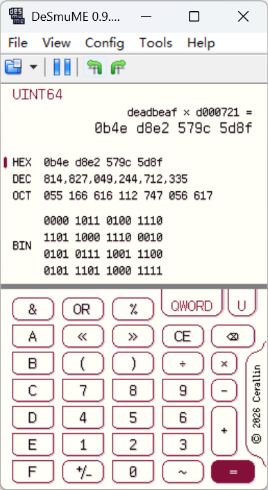

# HexCalculatorDS

[](https://github.com/Cerallin/HexCalculatorDS/actions/workflows/build.yml)
[](https://github.com/Cerallin/HexCalculatorDS/actions/workflows/test.yml)
[](https://github.com/Cerallin/HexCalculatorDS/actions/workflows/publish-container.yml)
[](https://github.com/Cerallin/HexCalculatorDS/releases)
[](https://github.com/Cerallin/HexCalculatorDS/blob/master/LICENSE)

An integer calculator for Nintendo DS.

## Screenshot (DeSmuME)



## Controls

The calculator supports both touch input on the sub screen and hardware key
input on the Nintendo DS.

### D-pad

Move to select buttons on the sub screen. The currently selected button will be highlighted with a focus sign. Pressing `A` will activate the
selected button, which is equivalent to touching the button on the sub screen.

### Face buttons

- `A`: activate the selected button
- `B`: backspace
- `X`: clear current input/formula
- `Y`: switch to the upper number width (QWORD/DWORD/WORD/BYTE)

### System and shoulder buttons

- `Select`: switch to the lower number base (hex/dec/oct/bin)
- `Start`: evaluate the formula
- `L`: switch to the previous formula page
- `R`: switch to the next formula page

## Milestones

### v1.0.0

- [x] input by touching sub screen
- [x] update current number
- [x] implement operators
- [x] add quotes to the formula tree
- [x] switch base: `hex`/`dec`/`oct`/`bin`
- [x] switch depth: `QWORD`/`DWORD`/`WORD`/`BYTE`
- [x] switch sign: `signed`/`unsigned`
- [x] evaluate the formula
- [x] disable number buttons with base
- [x] Implement bitwise not & negative
- [x] Implement backspace
- [x] Implement brackets

### v1.1.0

- [x] Activate last pressed button (show focus sign)
- [x] Count unclosed left brackets
- [x] Display version number on the sub screen

### v1.2.0

- [x] Scroll the formula
- [x] Add color themes
- [ ] Add background color to the `UINT32`
- [ ] Modify the font shadows

### v1.3.0

- [ ] New input view for binary input
- [ ] Add animations

### v2.0.0

- [ ] New view for GBA/NDS 16-bit color
- [ ] Enable download play

### License

This software is under GPL-2.0-or-later license.

    HexCalculatorDS - An integer calculator for Nintendo DS.
    Copyright (C) 2026  Cerallin <cerallin@cerallin.top>

    This program is free software; you can redistribute it and/or modify
    it under the terms of the GNU General Public License as published by
    the Free Software Foundation; either version 2 of the License, or
    (at your option) any later version.

    This program is distributed in the hope that it will be useful,
    but WITHOUT ANY WARRANTY; without even the implied warranty of
    MERCHANTABILITY or FITNESS FOR A PARTICULAR PURPOSE.  See the
    GNU General Public License for more details.

### Third parties

- [libnds](https://github.com/devkitPro/libnds) v1.8.x
- A **modified version** of [Ark Pixel Font](https://github.com/TakWolf/ark-pixel-font)

## Develop

### Devcontainer
This project supports VS Code Dev Container. To run the devcontainer:

- **Locally (with VS Code):**
  1. Open the project folder in VS Code.
  2. If prompted, click "Reopen in Container". Or use the command palette: `Dev Containers: Reopen in Container`.
  3. The environment will be automatically set up and ready for development.

- **GitHub Codespaces:**
  1. Open the repository in GitHub.
  2. Click the "Code" button and select "Open with Codespaces".
  3. The workspace will launch in a cloud devcontainer with all dependencies pre-installed.

### pre-commit
A git pre-commit hook is configured. Before each commit, all staged C/C++ files are automatically formatted using clang-format, according to the rules defined in the .clang-format file.

```sh
# Install clang-format if not present
sudo apt update && sudo apt install -y clang-format
# Intall the hooks
./scripts/install-hooks
```
